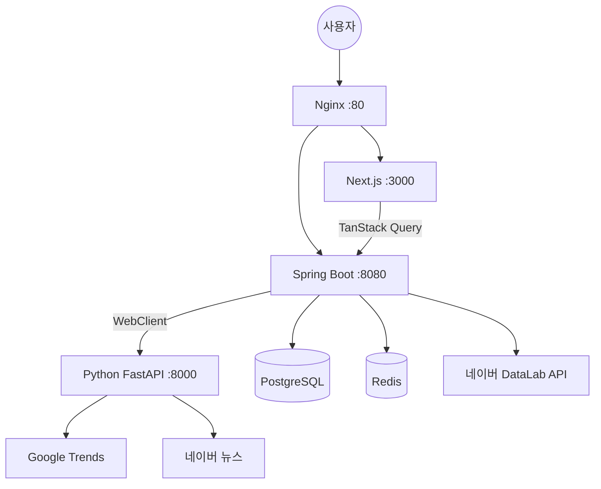

# Hybrid Trend Insights Platform

구글·네이버 트렌드 통합 분석 플랫폼 (Spring Boot + Python + Next.js)

---

## 시스템 아키텍처

```
사용자
  │
  ▼
Nginx (:80)
  ├── / → Next.js Frontend (:3000)
  └── /api/ → Spring Boot Backend (:8080)
                  ├── WebClient → Python FastAPI Scraper (:8000)
                  │               ├── Google Trends (pytrends)
                  │               └── 네이버 뉴스 (BeautifulSoup)
                  ├── WebClient → 네이버 DataLab 공식 API
                  ├── PostgreSQL (트렌드 데이터 영구 저장)
                  └── Redis (API 응답 캐시 1h/30m)
```



---

## 기술 스택

| 레이어 | 기술 |
|--------|------|
| Frontend | Next.js 14 (App Router), Tailwind CSS, Recharts, TanStack Query |
| Backend | Java 17, Spring Boot 3.3, Spring WebFlux, Spring Data JPA |
| Scraper | Python 3.11, FastAPI, pytrends, BeautifulSoup4, Pandas |
| DB | PostgreSQL 16 |
| Cache | Redis 7 |
| Infra | Docker, Docker Compose, Nginx |

---

## 프로젝트 구조

```
trend/
├── docker-compose.yml          # 전체 서비스 오케스트레이션
├── .env.example                # 환경변수 템플릿
├── .gitignore
│
├── scraper/                    # Python FastAPI 수집기
│   ├── Dockerfile
│   ├── requirements.txt
│   ├── main.py                 # FastAPI 앱 진입점
│   └── routers/
│       ├── google_trends.py    # /collect/google, /collect/google/realtime
│       └── naver_news.py       # /collect/naver-news, /collect/naver-news/batch
│
├── backend/                    # Spring Boot 메인 백엔드
│   ├── Dockerfile
│   ├── build.gradle
│   ├── settings.gradle
│   └── src/main/
│       ├── resources/
│       │   └── application.yml
│       └── java/com/trend/platform/
│           ├── TrendPlatformApplication.java
│           ├── config/
│           │   ├── WebClientConfig.java    # Scraper/Naver WebClient 빈
│           │   └── RedisConfig.java        # Redis 캐시 설정
│           ├── entity/
│           │   ├── Keyword.java            # 추적 키워드
│           │   ├── TrendData.java          # 플랫폼별 시계열 점수
│           │   └── DailyRank.java          # 일별 순위
│           ├── repository/
│           │   ├── KeywordRepository.java
│           │   ├── TrendDataRepository.java
│           │   └── DailyRankRepository.java
│           ├── dto/
│           │   ├── ScraperResponse.java    # Python 응답 매핑 DTO
│           │   └── TrendResponse.java      # API 응답 DTO
│           ├── service/
│           │   ├── ScraperClientService.java      # Python 호출 + Fallback
│           │   ├── TrendNormalizationService.java # 점수 표준화 알고리즘
│           │   └── TrendService.java              # 핵심 비즈니스 로직
│           ├── scheduler/
│           │   └── TrendScheduler.java     # 자동 수집 스케줄러
│           └── controller/
│               └── TrendController.java    # REST API 엔드포인트
│
├── frontend/                   # Next.js 대시보드
│   ├── Dockerfile
│   ├── package.json
│   ├── next.config.mjs
│   ├── tailwind.config.ts
│   ├── tsconfig.json
│   └── src/
│       ├── app/
│       │   ├── layout.tsx          # 루트 레이아웃 (Sidebar 포함)
│       │   ├── page.tsx            # / → /dashboard 리다이렉트
│       │   ├── globals.css
│       │   ├── dashboard/
│       │   │   └── page.tsx        # 순위 카드 + 트렌드 차트
│       │   ├── comparison/
│       │   │   └── page.tsx        # 키워드 비교 분석
│       │   └── ranking/
│       │       └── page.tsx        # 실시간 순위
│       ├── components/
│       │   ├── charts/
│       │   │   ├── TrendLineChart.tsx   # Recharts 시계열 차트
│       │   │   └── RankingCard.tsx      # 순위 카드
│       │   └── ui/
│       │       └── Sidebar.tsx          # 사이드 네비게이션
│       └── lib/
│           ├── api.ts              # axios 인스턴스 + API 함수 + 타입
│           └── providers.tsx       # TanStack Query Provider
│
└── nginx/
    └── nginx.conf              # 리버스 프록시 설정
```

---

## API 엔드포인트

### Python Scraper (내부용, Spring Boot만 직접 호출)

| Method | Path | 설명 |
|--------|------|------|
| GET | `/health` | 헬스체크 |
| GET | `/collect/google?keywords=&timeframe=&geo=` | 키워드 시계열 |
| GET | `/collect/google/realtime?geo=KR` | 실시간 인기 검색어 |
| GET | `/collect/google/related?keyword=` | 연관 검색어 |
| GET | `/collect/naver-news?keyword=` | 뉴스 헤드라인 + 감성분석 |
| GET | `/collect/naver-news/batch?keywords=` | 다중 키워드 뉴스 수집 |

### Spring Boot REST API (Frontend 호출)

| Method | Path | 설명 |
|--------|------|------|
| GET | `/api/v1/trends/dashboard` | 대시보드 통합 데이터 |
| GET | `/api/v1/trends/timeseries?keyword=&platform=&days=` | 시계열 데이터 |
| GET | `/api/v1/trends/compare?keywords=&platform=&days=` | 키워드 비교 |
| GET | `/api/v1/trends/ranking?platform=` | 최신 순위 |
| GET | `/api/v1/trends/keywords` | 추적 키워드 목록 |
| POST | `/api/v1/trends/keywords` | 키워드 등록 |

---

## DB 스키마

```sql
-- 추적 키워드
keywords (id, name UNIQUE, category, is_active, created_at, updated_at)

-- 플랫폼별 시계열 점수
trend_data (id, keyword_id, platform, record_date,
            normalized_score,  -- Z-score 표준화된 0~100
            raw_score,         -- 플랫폼 원본값
            news_mention_count, sentiment_score, collected_at)

-- 일별 순위
daily_ranks (id, keyword_id, platform, rank_position,
             rank_date, rank_change, created_at)
```

---

## 데이터 표준화 알고리즘

Google과 Naver의 0~100 수치는 기준 모집단이 달라 직접 비교 불가.
`TrendNormalizationService.java`에 구현된 처리 방식:

```
1. 플랫폼별 원본값 수집 (rawScore: 0~100)
        ↓
2. 시계열 내 Z-score 계산
   z = (x - mean) / stdDev
        ↓
3. Z-score를 Min-Max로 0~100 재스케일
   normalized = ((z - zMin) / (zMax - zMin)) * 100
        ↓
4. 플랫폼별 보정계수 적용
   Google 1.0 / Naver 0.95 / YouTube 0.85
        ↓
5. normalized_score로 DB 저장 → 플랫폼 간 비교 가능
```

---

## 스케줄러

| 주기 | 작업 |
|------|------|
| 매시간 정각 (`0 0 * * * *`) | Google 실시간 인기 검색어 수집 → `daily_ranks` 저장 |
| 매일 03:00 (`0 0 3 * * *`) | 등록 키워드 시계열 수집 (5개씩 배치, rate limit 대응) |

---

## Fallback 처리

Python Scraper 서비스가 다운되더라도 Spring Boot 서비스는 중단되지 않음.

```
ScraperClientService.fetchGoogleRealtime()
  → 정상: 수집 데이터 반환
  → 타임아웃/오류: 빈 리스트 반환 (경고 로그 출력)
  → Spring Boot: 기존 DB 데이터로 API 응답 계속 제공
```

---

## 배포 방법

### 사전 요구사항

- Docker Desktop 설치 및 실행
- 네이버 개발자센터 앱 등록 (DataLab API 사용 시)
  - https://developers.naver.com → 애플리케이션 등록 → `검색` 권한 추가

### 1단계: 환경변수 설정

```bash
cd D:\999.오찬열\00.project\trend

cp .env.example .env
```

`.env` 파일 편집:

```env
NAVER_CLIENT_ID=발급받은_클라이언트_ID
NAVER_CLIENT_SECRET=발급받은_클라이언트_시크릿
DB_PASSWORD=trend1234
```

### 2단계: 전체 빌드 & 실행

```bash
# 전체 빌드 후 백그라운드 실행
docker compose up -d --build

# 빌드 로그 실시간 확인 (선택)
docker compose logs -f
```

> 최초 빌드는 5~10분 소요 (Spring Boot Gradle 빌드 포함)

### 3단계: 서비스 상태 확인

```bash
docker compose ps
```

```
NAME              STATUS          PORTS
trend-nginx       Up              0.0.0.0:80->80/tcp
trend-frontend    Up              3000/tcp
trend-backend     Up (healthy)    8080/tcp
trend-scraper     Up (healthy)    8000/tcp
trend-postgres    Up (healthy)    5432/tcp
trend-redis       Up (healthy)    6379/tcp
```

### 4단계: 접속

| 서비스 | URL |
|--------|-----|
| 대시보드 | http://localhost |
| 키워드 비교 | http://localhost/comparison |
| 실시간 순위 | http://localhost/ranking |
| Scraper Swagger | http://localhost:8000/docs (개발 시) |
| Spring Actuator | http://localhost:8080/actuator/health (내부) |

---

## 자주 쓰는 명령어

```bash
# 서비스 중지
docker compose down

# 데이터 포함 완전 삭제
docker compose down -v

# 특정 서비스만 재빌드
docker compose up -d --build backend
docker compose up -d --build scraper

# 로그 확인
docker compose logs -f backend
docker compose logs -f scraper

# 스케줄러 즉시 트리거 (개발용 - Actuator 엔드포인트)
curl -X POST http://localhost:8080/actuator/scheduledtasks

# DB 직접 접속
docker exec -it trend-postgres psql -U trend -d trenddb

# Redis 직접 접속
docker exec -it trend-redis redis-cli
```

---

## 향후 확장 포인트

- **Naver DataLab 연동**: `application.yml`의 `naver.client-id/secret` 설정 후 `ScraperClientService`에 DataLab API 호출 추가
- **YouTube 트렌드**: `TrendData.Platform.YOUTUBE` 열거값 및 수집기 라우터 추가
- **알림**: 특정 키워드 순위 급변 시 슬랙/이메일 알림 (Spring Event + Scheduler)
- **인증**: Spring Security + JWT 추가로 대시보드 접근 제어
- **HTTPS**: Nginx에 Certbot (Let's Encrypt) SSL 인증서 적용
